# gemini_1.5_flash和gemini_2.5_pro 執行OCR測試結果
手寫中文OCR模型測試短句 (共4句) 請每位測試者都在同一張白紙上，寫下以下全部四個句子。<br>

綠色為缺少字,紅色為多餘字

```寫中文OCR模型測試短句
句子一：基礎測試 (常用字與流暢度)
今天天氣很好，我們下午去公園散步。
•	測試重點：
o	基本功：這句話全部由高頻常用字組成，是模型的「送分題」。如果這句辨識率就不高，代表模型基礎能力有問題。
o	常用標點：測試對逗號「，」和句號「。」的辨識能力。
o	連筆：像「我們」、「下午」這類詞語，人們在書寫時很可能會出現筆劃相連，這能考驗模型的字元切割能力。
句子二：混合內容測試 (數字與英文字母)
請在下午3點前，到A棟201號會議室開會。
•	測試重點：
o	混合辨識：這是真實世界中最常見的情境之一。測試模型能否在大量中文字中，準確辨識出阿拉伯數字 (3, 201) 和大寫英文字母 (A)。
o	易混淆字元：觀察模型是否會把 0 辨識成 O，或把 1 辨識成 l。
o	上下文理解：數字和字母穿插在句子中，考驗模型是否能正確斷詞。
句子三：難字挑戰 (複雜與相似字)
我辨認出臺灣的鳳梨酥包裝袋很精緻。
•	測試重點：
o	複雜結構字：這句話包含了「辨」、「認」、「臺」、「灣」、「鳳」、「梨」、「酥」、「裝」、「緻」等大量筆劃多、結構複雜的字，是模型的「壓力測試」。
o	相似字干擾：「辨」和「辯」、「臺」和「台」、「鳳」和「風」，這些都是容易搞混的字，考驗模型的細節分辨能力。
o	極端情況：如果這句話的辨識率依然很高，代表模型的實力非常強悍。
句子四：特殊標點與語氣測試
你真的相信「天下沒有白吃的午餐」這句話嗎？
•	測試重點：
o	特殊標點：測試模型對引號「」和問號「？」的處理能力。很多模型會忽略或辨識錯誤。
o	語氣詞：「嗎」字的辨識，以及整個問句的語氣結構。
o	俗語/成語：看看模型在處理這種固定搭配的詞語時，是否會因為內建的語言模型而有更高的準確率。


測試句子4句
測試人數5人
使用GOOGLE AI STUDIO APIKEY免費額度
gemini_ocr.py,readme.md撰寫 (GEMIMI CLI)
```

將第5張圖的gemini_1.5_flash便是結果與gemini_2.5_pro比較後結果提供gemini_2.5_pro修正結果如下<br>
檢視了您提供的兩組由不同OCR模型辨識出的文字，並進行比對與修正後，正確的文句如下：<br>
•	今天天氣很好，我們下午去公園散步。<br>
修正說明：第一個版本中的「天氣」和「公園」在語意上比第二個版本的「天氣」和「國慶」更為通順合理。一般來說，人們會因為天氣好而去公園散步。<br>
•	請在下午3點前，到B棟201號會議室開會。<br>
修正說明：第一個版本提供了完整的開會地點「B棟201號會議室」，而第二個版本僅有「會議室」，資訊較不完整。同時，第一個版本的「3點前」表述比「三點前」在現代文書中更為常見。<br>
•	我辨認出台灣的鳳梨酥包裝袋很精緻。<br>
修正說明：兩個版本的這句話完全相同，且文意通順，因此無需修正。台灣的鳳梨酥及其包裝確實以精緻聞名。[6][7][8]<br>
•	你真的相信「天下沒有白吃的午餐」這句話嗎？<br>
修正說明：第二個版本中的「天下沒有白吃的午餐」是完整的諺語。 第一個版本的引號使用方式「天下沒有白吃的午餐這句話嗎？」在標點符號的運用上較不標準。<br>


## 1.
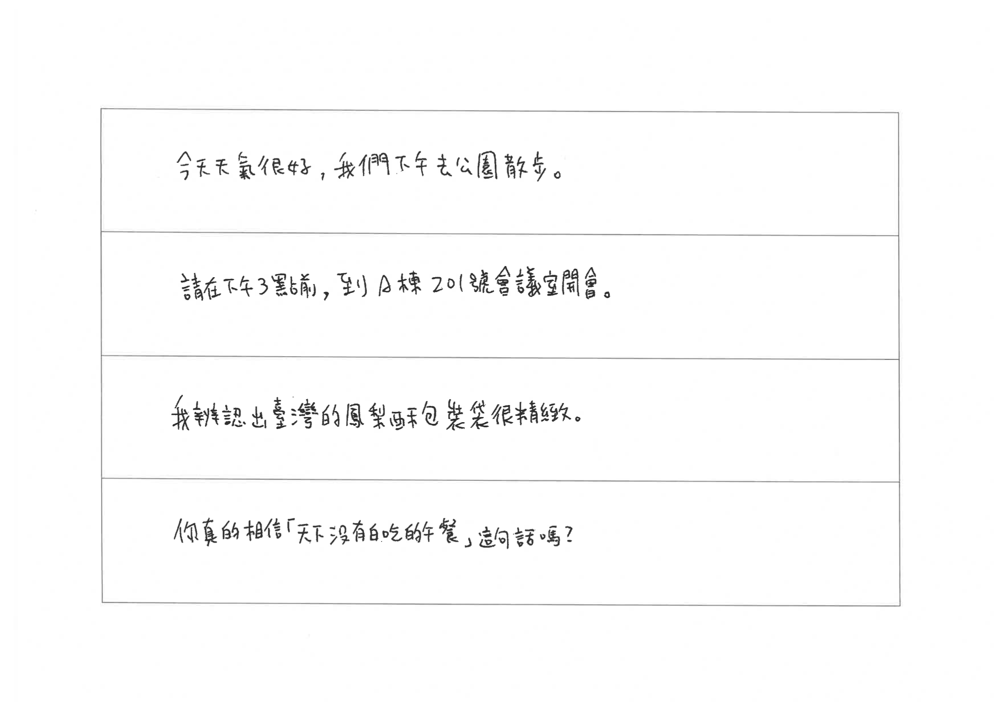
### gemini_1.5_flash </br>
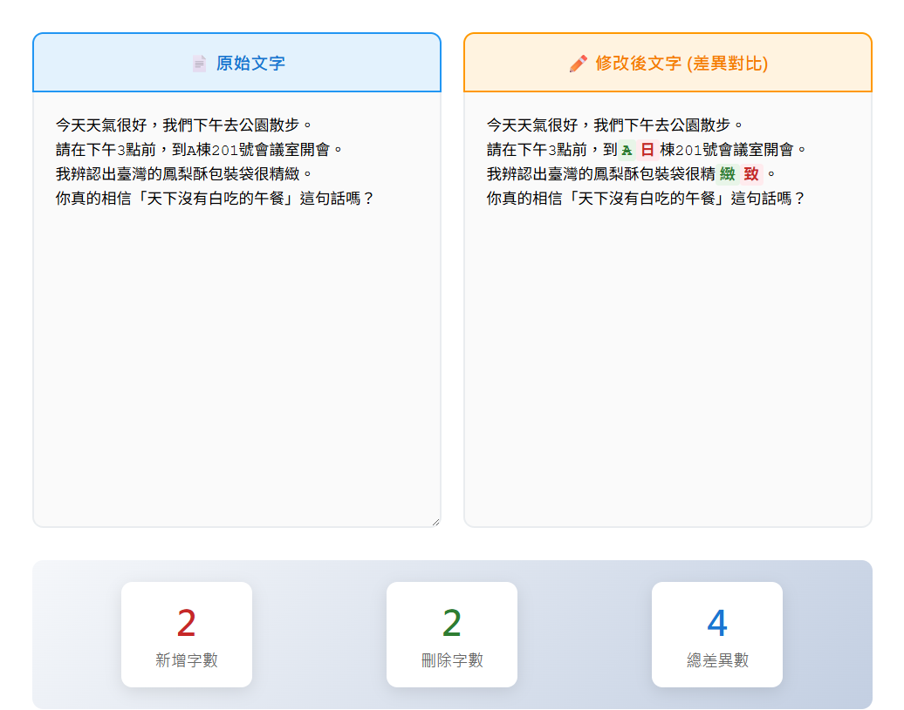
### gemini_2.5_pro </br>
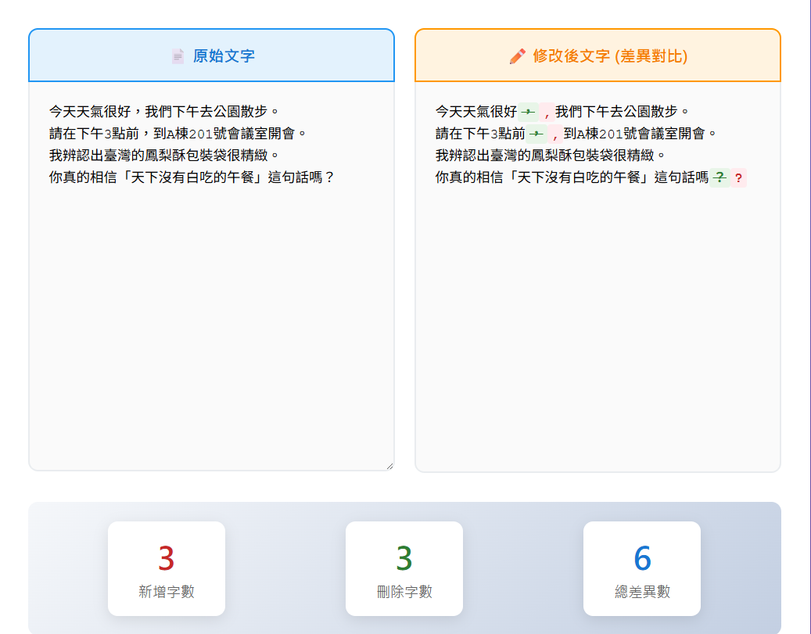

## 2.
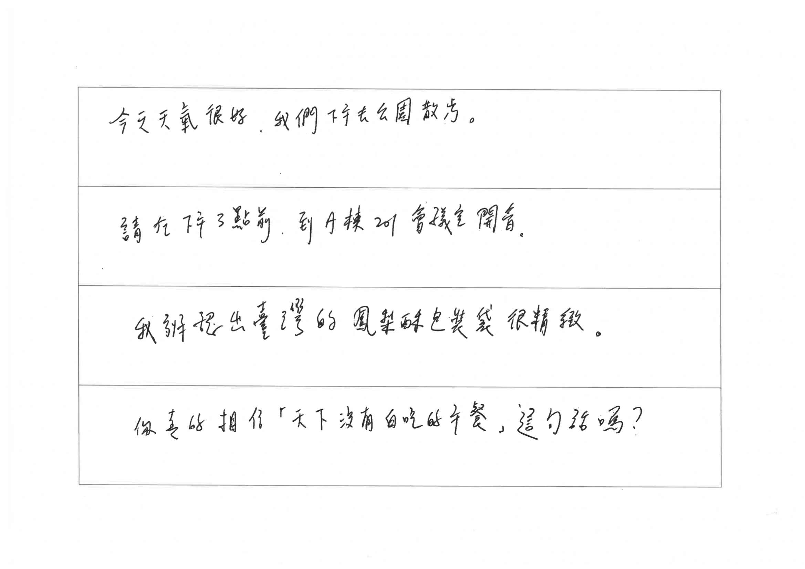
### gemini_1.5_flash </br>
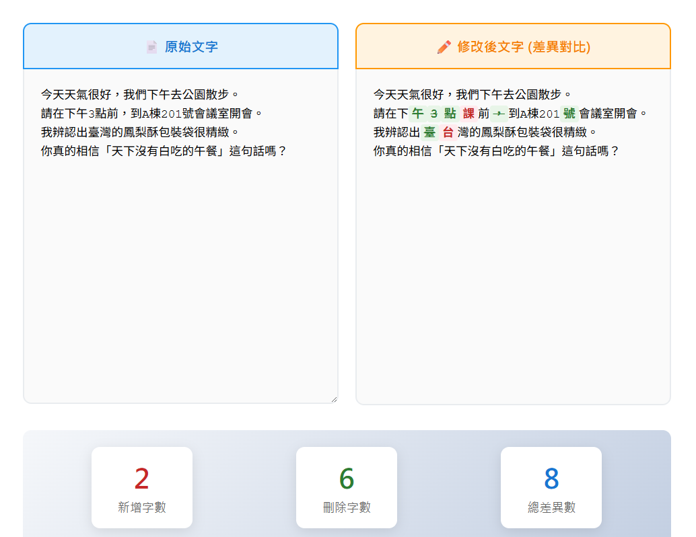
### gemini_2.5_pro </br>
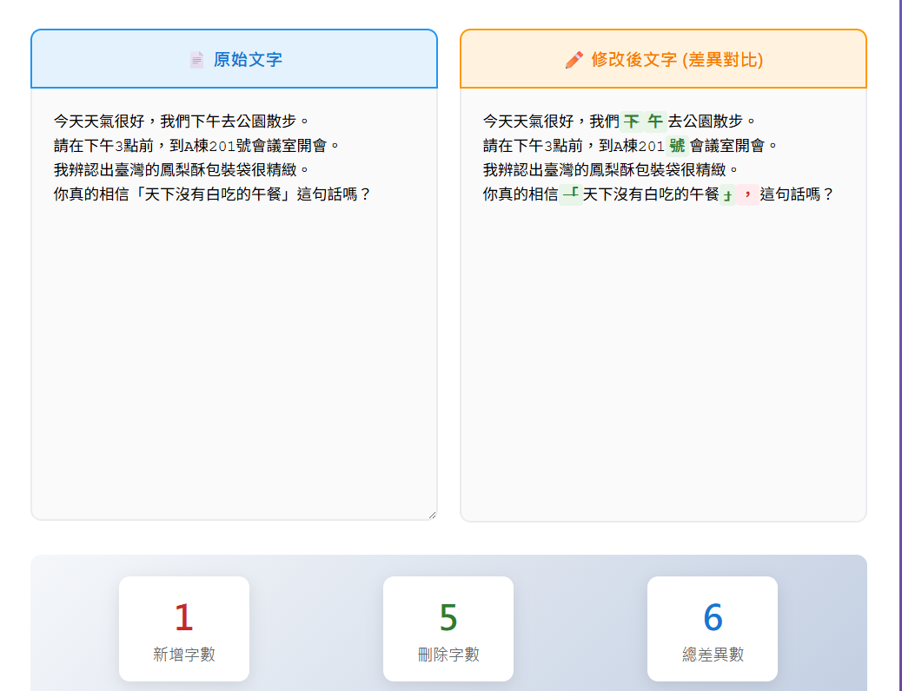


## 3.
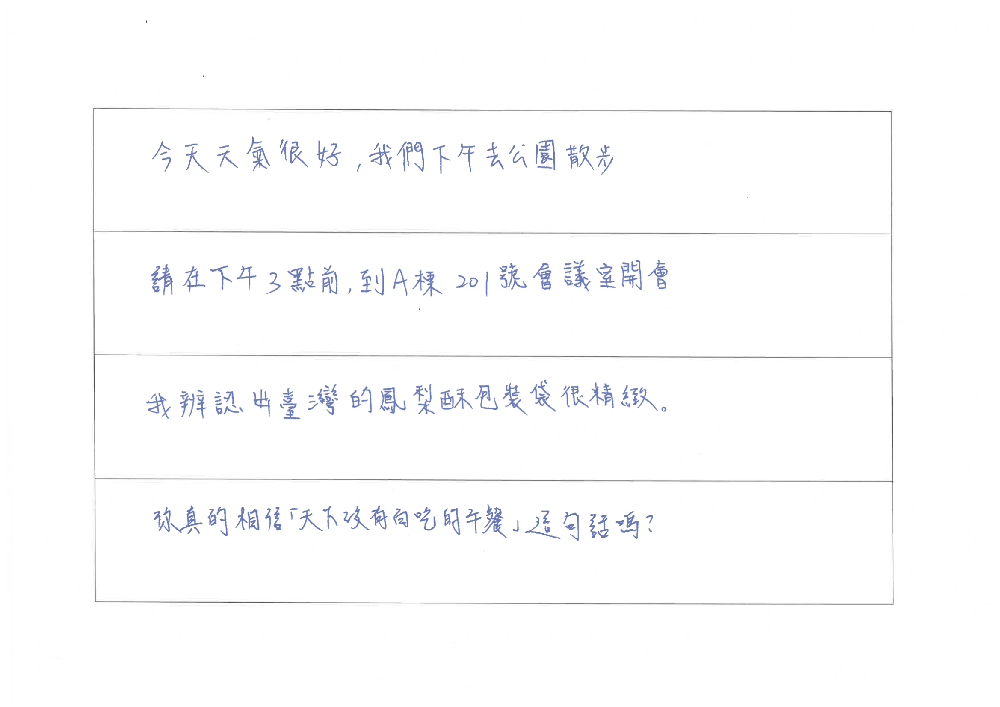
### gemini_1.5_flash </br>
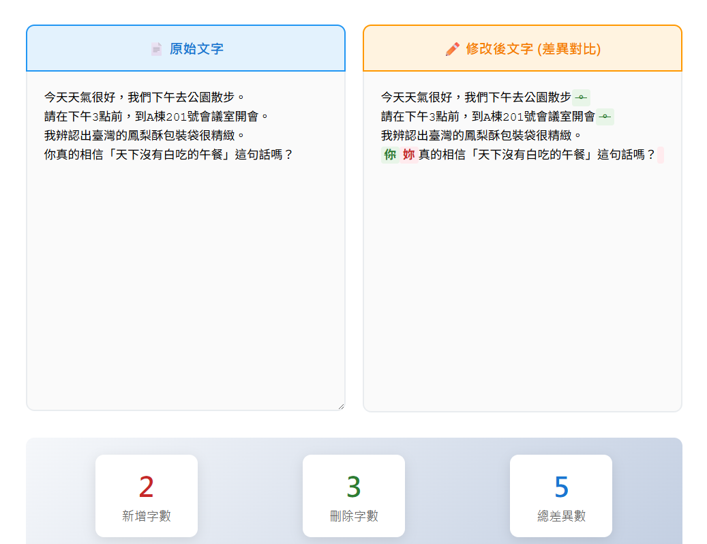
### gemini_2.5_pro </br>


## 4.
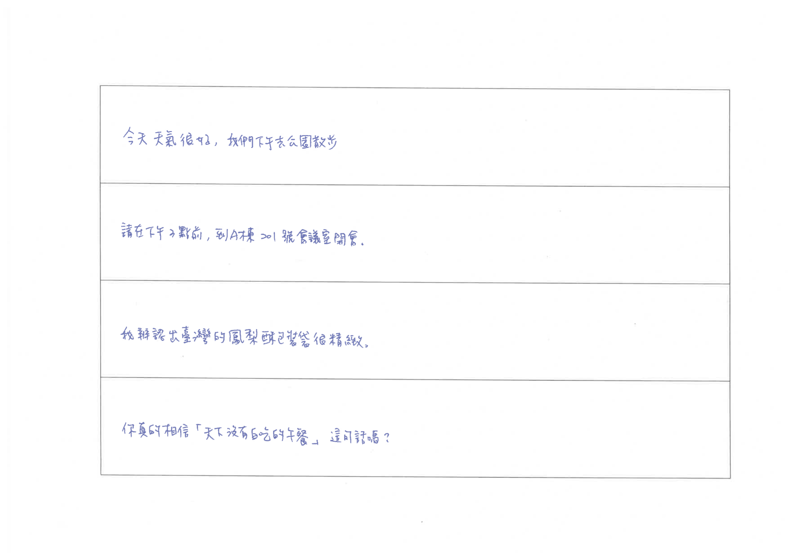
### gemini_1.5_flash</br>
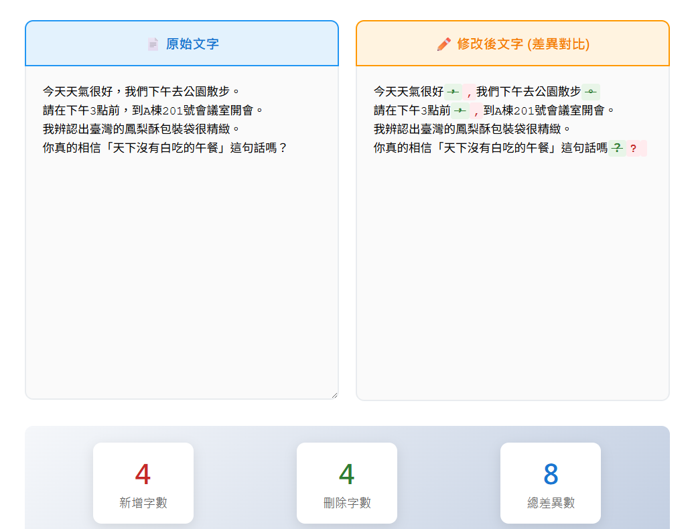
### gemini_2.5_pro </br>
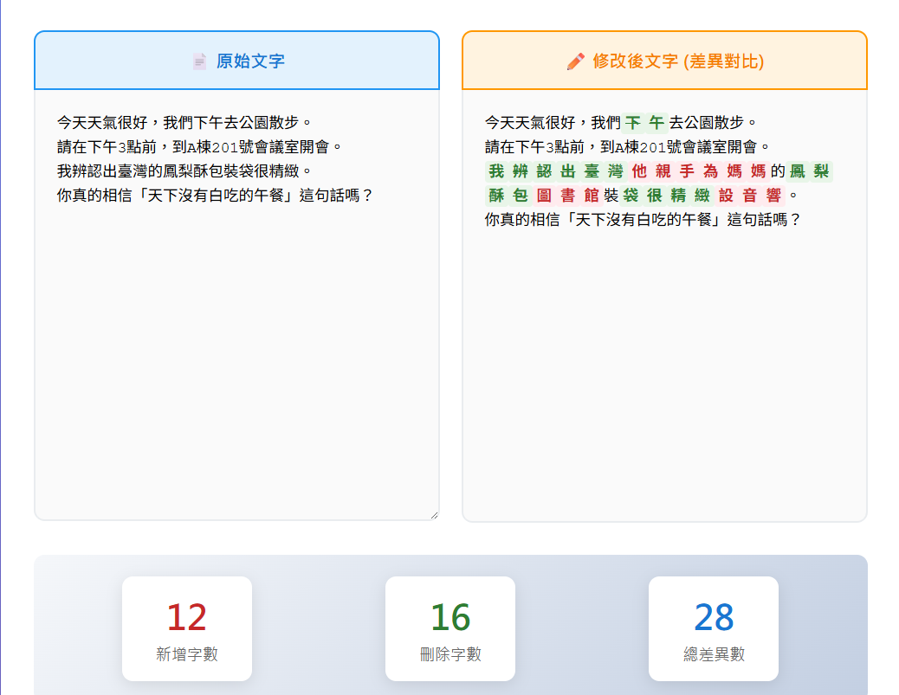


## 5.
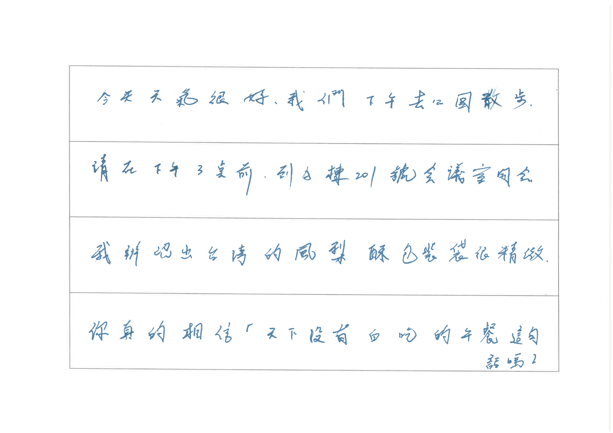
### gemini_1.5_flash</br>
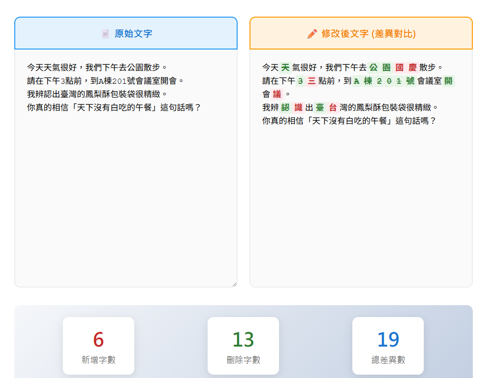
### gemini_2.5_pro </br>
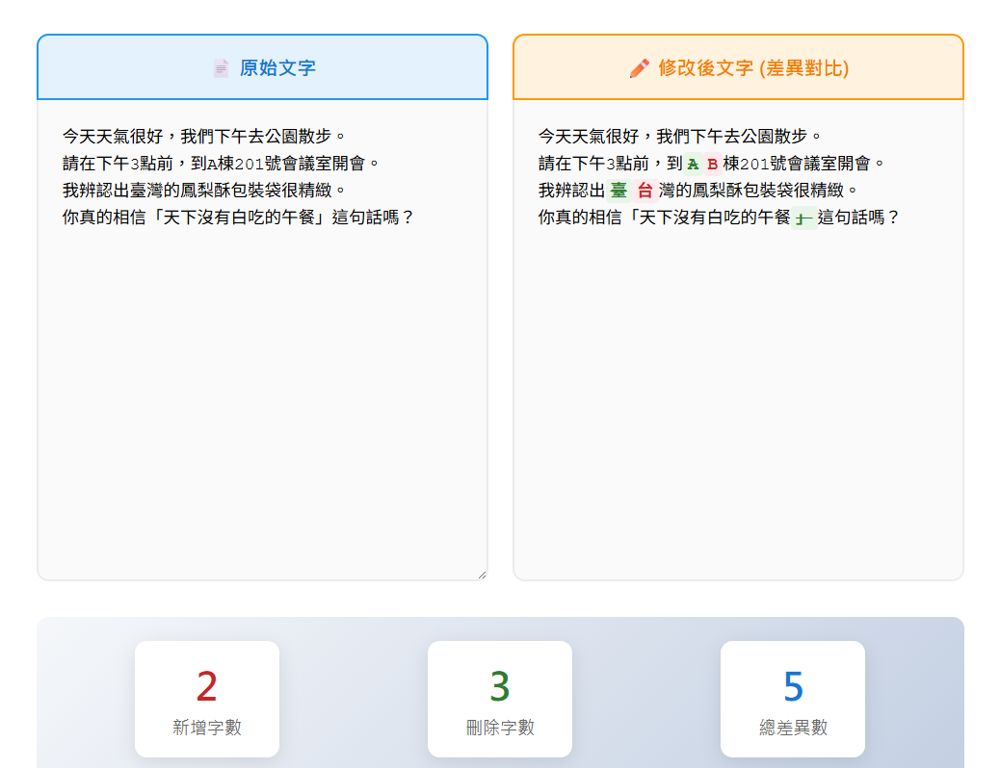


